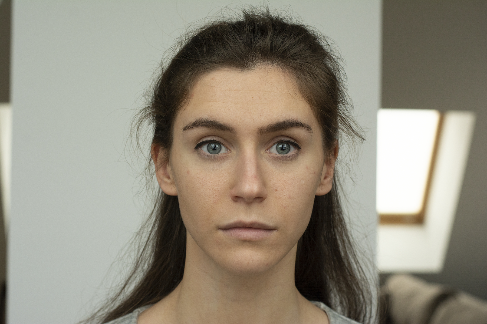

# *FaceBuilder* automatic head reconstruction tutorial

## Description
This tutorial covers how to use `pykeentools.FaceBuilder` for automatic head reconstruction.

## Recap
1. Problem statement;
2. `_ConstantCameraInput`;
3. Detecting a face on photos;
4. Writing head geometry to an `.obj` file;
5. Building head texture;
6. Summary.


## *FaceBuilder* automatic head reconstruction step-by-step tutorial
### 1. Problem statement
In this tutorial we are going to create a simple script that tries to reconstruct head geometry with
texture from a set of photos of a person.

To simplify the task we are going to assume that:
- the person has neutral facial expression on every photo;
- tha same camera was used for every photo;
- we know the camera parameters. 

We need to implement this function:
```python
def reconstruct_head_geometry(fl, h_aperture, img_w, img_h, images_dir, out_texture_path, out_obj_path):
    pass
```

It takes camera parameters (`fl, h_aperture, img_w, img_h`) and a path to a directory with input photos.
The function is expected to write reconstructed head geometry to `out_obj_path` and reconstructed 
texture to `out_texture_path`.

We have test data included in this tutorial. It consists of 10 photos like this one:



We know what camera was used to take the photos. So we can call our `reconstruct_head_geometry` function
with the next parameters:
```python
reconstruct_head_geometry(fl=50.0, h_aperture=23.6, img_w=1800, img_h=1200, images_dir='./photos',
                          out_texture_path='face_texture.jpg', out_obj_path='head.obj')
                              
```

To get something like this:


### 2. `_ConstantCameraInput`
To begin with we need a CameraInput. We know the camera parameters, and they are constant for all 
the photos. This `_ConstantCameraInput` implementation is what we need for our task:
```python
class _ConstantCameraInput(pkt.FaceBuilderCameraInputI):
    def __init__(self, fl, h_aperture, img_w, img_h):
        super().__init__()
        self._proj_mat = pkt.math.proj_mat(
            fl_to_haperture=fl / h_aperture, w=img_w, h=img_h, pixel_aspect_ratio=1.0, near=0.1, far=1000.0)
        self._img_size = (img_w, img_h)

    def projection(self, frame):
        return self._proj_mat

    def view(self, frame):
        return np.eye(4)

    def image_size(self, frame):
        return self._img_size
```

See [*FaceBuilder* basic tutorial](./../face_builder_tutorial/README.md) for more information about
`pkt.FaceBuilderCameraInputI`.

### 3. Detecting a face on photos
Then we need to load the photos and detect person face on every one of them.

Here is how face detection (align face) looks like in Nuke:


The head shape and position are not ideal, but they are OK for fully automatic solution.

We are going to load the photos and create a `FaceBuilder` object with `_ConstantCameraInput`.
We covered loading images in [*TextureBuilder* tutorial](./../texture_builder_tutorial/README.md).
So we are going to skip the details.
```python
images = _load_images(images_dir)

camera_input = _ConstantCameraInput(fl, h_aperture, img_w, img_h)
fb = pkt.FaceBuilder(camera_input)
```

Now, for every photo we load we are going to detect face there with `FaceBuilder`.
```python
for image_idx, image in enumerate(images):
    face_infos = fb.detect_faces(image, pixel_aspect=1.0)
    if len(face_infos) != 1:
        print('Image %d skipped. It has %d faces detected' % (image_idx, len(face_infos)))
        continue
    detected = fb.set_detected_face_pose_keyframe(image_idx, face_infos[0])
    if detected:
        print('Successfully detected face in frame %d' % image_idx)
    else:
        print('Face box detected, but face detection failed in frame %d' % image_idx)
```
There are two methods we utilize here:
- `detect_faces(img, pixel_aspect)` method detects face bounding boxes on the image;
- `set_detected_face_pose_keyframe(frame, face_info)` method detects face in specified face box
and sets up a keyframe (this method also runs `FaceBuilder` solution to estimate head shape 
and position).

Notice how we check `len(face_infos) != 1` for cases where there is no faces detected or multiple faces
detected (we could have chosen a face in this case, e.g. by bounding box size, but are going to skip it
for now).

Also notice that even with successful face box detection face detection may fail. So we check the 
returned value `detected`.

Notice that in `FaceBuilder` we can use any `int` number to create keyframes. 
So we used `image_idx` as a frame number for convenience.
Now we can get `fb.keyframes()` and this will return us a list of image indexes we detected a face on.

After running `set_detected_face_pose_keyframe` for every photo we detected a face on we check that
at least one *detect* was successful:
```python
added_images = fb.keyframes()
if len(added_images) == 0:
    print('Cannot reconstruct head geometry. No faces detected')
    return
```


### 4. Writing head geometry to an `.obj` file
As we have at least one keyframe we know that we have a rough approximation of a head shape and at least
one photo we can reproject texture from.

Let's start with saving head geometry to an `.obj` file. `.obj` is a simple text file format, so we can 
write it directly:
```python
def _write_geo_to_obj(geo: pkt.Geo, out_obj_path: str):
    assert(geo.meshes_count() == 1)
    mesh: pkt.Mesh = geo.mesh(0)
    assert(mesh.normals_attribute() == 'VERTEX_BASED')
    assert(mesh.uvs_attribute() == 'VERTEX_BASED')
    with open(out_obj_path, mode='w') as out_obj:
        for p_idx in range(mesh.points_count()):
            p = mesh.point(p_idx)
            out_obj.write('v %f %f %f\n' % (p[0], p[1], p[2]))

        for f_idx in range(mesh.faces_count()):
            for fv_idx in range(mesh.face_size(f_idx)):
                vt = mesh.uv(f_idx, fv_idx)
                out_obj.write('vt %f %f\n' % (vt[0], vt[1]))

        for f_idx in range(mesh.faces_count()):
            for fv_idx in range(mesh.face_size(f_idx)):
                vn = mesh.normal(f_idx, fv_idx)
                out_obj.write('vn %f %f %f\n' % (vn[0], vn[1], vn[2]))

        offset = 0
        for f_idx in range(mesh.faces_count()):
            face = ['/'.join([str(mesh.face_point(f_idx, v_idx) + 1), str(offset + v_idx + 1), str(offset + v_idx + 1)])
                    for v_idx in range(mesh.face_size(f_idx))]
            offset += mesh.face_size(f_idx)
            out_obj.write('f %s\n' % ' '.join(face))

            
_write_geo_to_obj(fb.applied_args_model(), out_obj_path)
```

Notice that this function is expecting a geometry with a single mesh with `VERTEX_BASED` attributes.
You need to modify it to use it with arbitrary `pkt.Geo`.

### 5. Building head texture
We've covered building texture in [*TextureBuilder* tutorial](./../texture_builder_tutorial/README.md).

Here we don't need `ProgressCallback`, se we are ging to use this no-op class:
```python
class ProgressCallback(pkt.ProgressCallback):
    def set_progress_and_check_abort(self, progress):
        return False
```

The `frame_data_loader` will load data directly from `FaceBuilder`, `camera_input` and loaded `images`:
```python
def frame_data_loader(keyframe_idx: int):
    frame_data = pkt.texture_builder.FrameData()
    image_idx = added_images[keyframe_idx]
    frame_data.geo = fb.applied_args_model_at(image_idx)
    frame_data.image = images[image_idx]
    frame_data.model = fb.model_mat(image_idx)
    frame_data.view = camera_input.view(image_idx)
    frame_data.projection = camera_input.projection(image_idx)
    return frame_data
```

Now we can build texture and write it the same way we did in 
[*TextureBuilder* tutorial](./../texture_builder_tutorial/README.md):
```python
built_texture_rgba = pkt.texture_builder.build_texture(
    frames_count=len(added_images),
    frame_data_loader=frame_data_loader,
    progress_callback=ProgressCallback(),
    texture_w=2048,
    texture_h=2048
)

_write_image(out_texture_path, built_texture_rgba)
```

### 6. Summary
Using `FaceBuilder` we have implemented a simple but powerful script that allows us to
automate head reconstruction process. As the result we get head geometry as an `.obj` file and
head texture. They can be used in any other software supporting that file formats.

You can find the whole code combined in [src/main.py](./src/main.py). 
Do not forget to [install pykeentools](./../pykeentools_installation_tutorial/README.md) and 
`pip install -r requirements.txt` before running.
