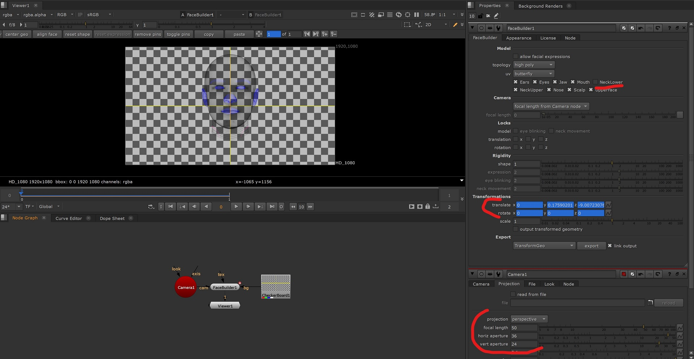

# *FaceBuilder* basic tutorial

## Description
This tutorial covers `pykeentools.FaceBuilder` interface and how it can be used.
Here you can learn how to create `FaceBuilder`, manipulate pins, run solver to update head
shape and position and so on.

## Recap
1. `FaceBuilder` review;
2. Creating a `FaceBuilder` object (`FaceBuilderCameraInputI`);
3. Basic `FaceBuilder` methods (geometry, licensing, serialization);
4. Manipulating pins and keyframes in `FaceBuilder`;
5. Summary.


## *FaceBuilder* step-by-step tutorial
### 1. *FaceBuilder* review
`FaceBuilder` is a class that implements all of *FaceBuilder* logic except GUI. 
It is used to implement 
[*FaceBuilder for Blender*](https://keentools.io/products/facebuilder-for-blender) and 
[*FaceBuilder for Nuke*](https://keentools.io/products/facebuilder-for-nuke).

Basically almost for every button (like topology switch or center geo) or operation (like adding a pin)
there is a method in `FaceBuilder` class.

### 2. Creating a `FaceBuilder` object
`FaceBuilder` uses data directory to load face models.
See [installation tutorial](./../pykeentools_installation_tutorial/README.md) for information 
about data directory.

The only thing required for basic `FaceBuilder` constructor is `FaceBuilderCameraInputI`.
`FaceBuilderCameraInputI` is an interface used by `FaceBuilder` to access camera related information like
`view`, `projection` matrices as well as image format in specific frames 
(in this tutorial we are going to use one keyframe).
See [*TextureBuilder* tutorial](./../texture_builder_tutorial/README.md) for information 
about matrices in *KeenTools core library*.

We should implement `FaceBuilderCameraInputI` to provide `FaceBuilder` with relevant information 
about our camera setup. 

In this tutorial we are going to set `view` matrix to identity (`np.eye(4)`) as we want `FaceBuilder`
to position the head relative to a camera in Origin position. We are also going to use FullHD frame and a full-frame camera with focal length of `50`.

Let's create our `FaceBuilderCameraInputI` accordingly:
```python
import pykeentools as pkt
import numpy as np


class _FBCameraInput(pkt.FaceBuilderCameraInputI):
    def projection(self, frame):
        assert frame == 0
        return pkt.math.proj_mat(
            fl_to_haperture=50.0/36, w=1920.0, h=1080.0, pixel_aspect_ratio=1.0, near=0.1, far=1000.0)

    def view(self, frame):
        assert frame == 0
        return np.eye(4)

    def image_size(self, frame):
        assert frame == 0
        return 1920, 1080
```

Now we can create a `FaceBuidler` object:
```python
camera_input = _FBCameraInput()
face_builder = pkt.FaceBuilder(camera_input)
```

### 3. Basic `FaceBuilder` methods
Now when we have the `face_builder` object we can explore its methods.

#### Geometry
There is a bunch of methods to work with head geometry in `FaceBuilder`. Let's try some of the most important 
ones:
```python
def _try_geometry_methods(face_builder):
    # There are multiple models(topologies) available in FaceBuilder
    # Lets print them
    print('Available FaceBuilder models:')
    for topology_info in face_builder.models_list():
        print('\tTopology (name="%s", LOD="%s")' % (topology_info.name, topology_info.level_of_detail))
    # we can switch model by calling face_builder.select_model(). Let's stick with the default model for now
    print('By default "%s" model is used' % face_builder.models_list()[face_builder.selected_model()].name)

    # this method returns pkt.Geo object representing current head with current shape applied
    # as we haven't moved any pins this is a neutral head model
    neutral_model: pkt.Geo = face_builder.applied_args_model()
    print('Default FaceBuilder head model consists of %d mesh, has %d vertices and %d faces' %
          (neutral_model.meshes_count(), neutral_model.points_count(), neutral_model.faces_count()))
    assert(neutral_model.meshes_count() == 1)
    neutral_model_mesh: pkt.Mesh = neutral_model.mesh(0)
    print('FaceBuilder head model has %s uv and %s normal attributes' %
          (neutral_model_mesh.uvs_attribute(), neutral_model_mesh.normals_attribute()))

    # There is a method to get head model from specific keyframe: face_builder.applied_args_model_at(frame)
    # It is different when non-neutral expressions mode is enabled.

    # There are methods to work with head masks. You can enable/disable different parts of the model with them
    # Let's print available mask names:
    print('Available FaceBuilder masks: %s' % face_builder.mask_names())
    assert 'NeckLower' in face_builder.mask_names()
    # Let's disable NeckLower in our model
    face_builder.set_mask(face_builder.mask_names().index('NeckLower'), False)

    # There are also convenience methods:
    # - to get geometry hash
    print('Shape applied hash is "%s"' % face_builder.applied_args_model_hash())
    # - to get geometry vertices only (instead of full geometry for performance)
    # face_builder.applied_args_model_vertices_at(frame)
```


#### Licensing
Some of `FaceBuilder` methods require an active *FaceBuilder* license.

For example `FaceBuilder.solve_for_current_pins` will raise `pykeentools.UnlicensedException` error if
no license is available.

You can use `pykeentools.LicenseManager` to get licensing information:
```python
def _print_face_builder_licensing_information():
    fb_license_manager: pkt.LicenseManager = pkt.FaceBuilder.license_manager()

    fb_license_available = fb_license_manager.license_running(strategy=pkt.LicenseCheckStrategy.FORCE)
    print('FaceBuilder license is %s' % ('active' if fb_license_available else 'not active'))
    print('FaceBuilder license status text:')
    print(fb_license_manager.license_status_text(strategy=pkt.LicenseCheckStrategy.FORCE).replace('<br />', '\n'))
```


#### Serialization
There are two important methods in `FaceBuilder`: `serialize` and `deserialize`.
You can use them to save/load `FaceBuilder` state to a file.
Those methods can also be used to implement Undo/Redo mechanic.

Let's clone our `face_builder` instance using the same `camera_input`:
```python
def _clone_face_builder(face_builder, camera_input):
    serialized_fb: str = face_builder.serialize()
    print('Serialized FaceBuilder string length: %d' % len(serialized_fb))

    face_builder_clone = pkt.FaceBuilder(camera_input)
    successful_deserialization = face_builder_clone.deserialize(serialized_fb)
    assert successful_deserialization

    # Let's check our mask settings are deserialized and NeckLower is disabled
    assert not face_builder_clone.masks()[face_builder.mask_names().index('NeckLower')]
```

##### A small tip
You can find serialized `FaceBuilder` object in Blender attributes (or Nuke's `.nk` file), deserialize 
it with `pykeentools.FaceBuilder` and play with it in Python.


### 4. Manipulating pins and keyframes in `FaceBuilder`
*FaceBuilder* is built around manipulating pins in different frames.
It mostly uses pin positions in different frames to determine a head shape.
*FaceBuilder* doesn't need actual photos (except for the "align face" feature).

Let's create keyframe with a head in the center of the image:
```python
def _create_keyframe(face_builder):
    # There are no keyframes in a newly created FaceBuilder
    assert len(face_builder.keyframes()) == 0

    # The easiest way to set up a keyframe is to use set_centered_geo_keyframe method
    # We are going to set up keyframe in frame 0, as expected by our _FBCameraInput implementation
    # FaceBuilder is going to create a keyframe and place head in front of the camera
    # (using view and projection matrices from our _FBCameraInput)
    face_builder.set_centered_geo_keyframe(0)

    # Let's check the position our head is in frame 0
    print('Centered head\'s translation is %s (%.1f units away from the camera and %.1f up)' %
          (face_builder.model_mat(0)[0:3, 3], face_builder.model_mat(0)[2, 3], face_builder.model_mat(0)[1, 3]))
```
Here is how a similar scene would look in Nuke:



Notice that we have the same camera settings in Nuke and in `_FBCameraInput` and get the same translation
in Nuke and in Python after creating centered geo keyframe. 

Now we can add a pin in this keyframe and move it a little:
```python
def _add_and_move_pin(face_builder):
    # Let's try adding pin in the bottom left corner of the image
    pin = face_builder.add_pin(0, np.array([0, 0]))
    # pin wasn't added because we missed the model
    assert pin is None

    # Let's add a pin in the middle of the image
    # we know that the model is there, so we should hit the model
    pin: pkt.Pin = face_builder.add_pin(0, np.array([1920 / 2, 1080 / 2]))
    assert pin is not None
    # Pin is a connection between a 3d point on a surface of the head and a 2d point on the image
    print('Added pin:')
    print('\timage position = "%s"' % pin.img_pos)
    print('\tsurface position is specified by 3 geometry point indexes "%s" and barycentryc coordinates "%s"' %
          (pin.surface_point.geo_point_idxs, pin.surface_point.barycentric_coordinates))

    # Let's now move the pin 100 pixels right
    face_builder.move_pin(0, 0, np.array([1920 / 2 + 100, 1080 / 2]))

    # There is a convenience method to get all pins in keyframe for drawing
    for proj_pin in face_builder.projected_pins(0):
        print('Projected pin after move pin: (img position = "%s", projected surface point position = "%s")' %
              (proj_pin.img_pos, proj_pin.surface_point))

    # Notice how img position and projected surface point position doesn't match
    # this is because we need to call solve_for_current_pins method to run FaceBuilder solver
    # this will update head position in every keyframe, head shape, facial expressions (if enabled),
    # focal length (if focal length estimation is enabled)
    face_builder.solve_for_current_pins(0)

    # With only one keyframe and only one pin FaceBuilder will only move the head around.
    # Let's check the updated model matrix. It should move a little to the right:
    print('Updated head\'s translation after moving pin right is %s' % face_builder.model_mat(0)[0:3, 3])
```

Here is how a similar scene would look in Nuke:


### 5. Summary
Now we know how to use `FaceBuilder` basic methods. We also know how to create keyframes, create pins,
move pins and call `FaceBuilder` solver to estimate head positions and shape.

You can find the whole code combined in [src/main.py](./src/main.py). 
Do not forget to [install pykeentools](./../pykeentools_installation_tutorial/README.md) and 
`pip install -r requirements.txt` before running.
