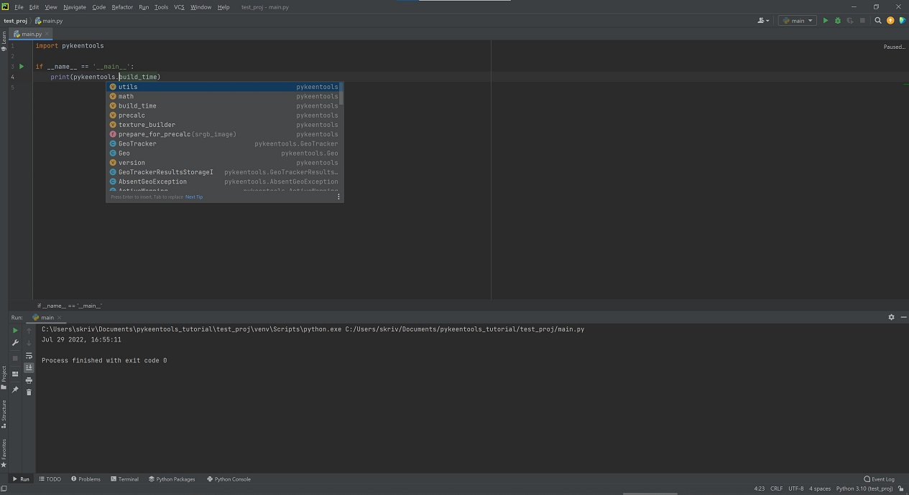

# *pykeentools* installation tutorial

## Description
This tutorial covers basic *pykeentools* installation and usage.

## Recap
1. Install [Python](../README.md#keentools-core-library-supported-platforms) and `numpy`;
2. [Download](https://keentools.io/download/core) and unpack *KeenTools core library* (a.k.a. *pykeentools*);
3. Add directory `./pykeentools_installation/pykeentools` to PYTHONPATH;
4. From Python import pykeentools module `import pykeentools as pkt`
and use *pykeentools*. E.g.  
`print('pykeentools %s, built %s' % (pkt.__version__, pkt.build_time))`;
5. Helpful information. Tips and tricks.


## *pykeentools* installation step-by-step guide
### 1. Requirements
In this tutorial we use Python 3.9 in `ubuntu:20.04` docker container to try *pykeentools*.  
You can use other python versions and operating systems.
See [supported platforms](../README.md#keentools-core-library-supported-platforms).


```
# Run docker container:
docker run -ti ubuntu:20.04 /bin/bash
apt update

# Install Python 3.9 and create `venv`
apt install -y python3.9 python3.9-venv
python3.9 -m venv venv
source venv/bin/activate

# Install requirements. The only requirement *pykeentools* has is `numpy`.
pip install  numpy
```

### 2. Download and unpack *pykeentools*

```
apt install -y wget unzip
wget -O keentools-core.zip https://downloads.keentools.io/keentools-core-2022_2_0-linux 
unzip keentools-core.zip
```

*pykeentools* bundle contains `pykeentools_installation` directory containing:
- `pykeentools` directory with *pykeentools* binary extension modules for different Python versions 
and *pykeentools* binary dependencies;
- `data` directory with important data required by *pykeentools*. See `KEENTOOLS_DATA_PATH`;
- utility files.

#### `KEENTOOLS_DATA_PATH` 
By default `data` directory is searched relative to *pykeentools* binary extension module as `../data`.  
You can change `data` directory search location by using `KEENTOOLS_DATA_PATH` environment variable.  
The variable path should be absolute or relative to *pykeentools* binary extension module.  
E.g. `os.environ['KEENTOOLS_DATA_PATH'] = '../data'`

### 3. Add `pykeentools` directory to Python path
To be able to `import pykeentools` you should add `pykeentools_installation/pykeentools` to PYTHONPATH.

There are multiple ways to do it. For example, you can do it from Python by modifying 
[`sys.path`](https://docs.python.org/3/library/sys.html#sys.path).

Here we are going to use `PYTHONPATH` environment variable:
```
export PYTHONPATH=/pykeentools_installation/pykeentools/
```

### 4. Use *pykeentools* module from Python

```
python3.9 -c "import pykeentools as pkt; print('pykeentools %s, built %s' % (pkt.__version__, pkt.build_time))"
# pykeentools 2022.2.0, built Jul 29 2022, 13:42:28
```

### 5. Helpful information. Tips and tricks.
#### Use `help()` function to see information on *pykeentools* methods, classes and modules:
```
python3.9 -c "import pykeentools as pkt; help(pkt)"
```

#### Use IDE and stubs for better development experience 
For example, using *PyCharm* you can add `pykeentools_installation/pykeentools/` to 
[`Interpreter paths`](https://www.jetbrains.com/help/pycharm/installing-uninstalling-and-reloading-interpreter-paths.html).  
This will enable you to run your scripts using *pykeentools* from *PyCharm*.
*PyCharm* will also generate stubs for `pykeentools` module to enable autocomplete.


#### See [other tutorials](../README.md#tutorials-list) for *pykeentools* usage examples.
